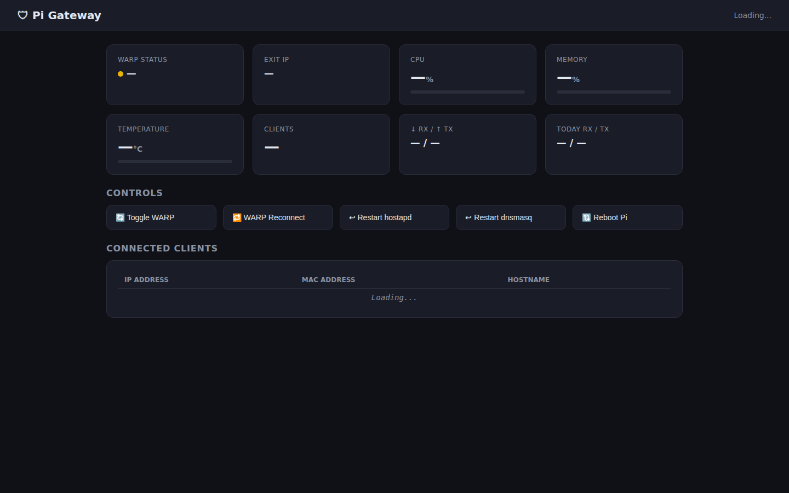
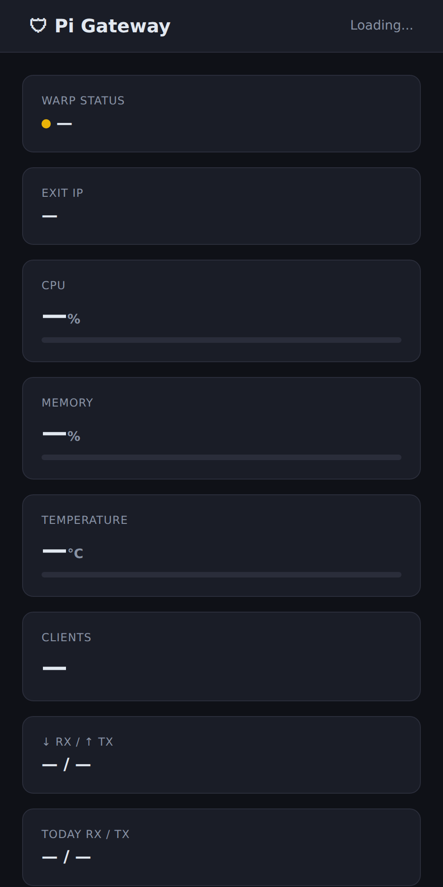

<div align="center">


# WarpGate

**Raspberry Pi Cloudflare WARP gateway** — turn a Pi into a WARP-tunneled Wi-Fi access point with a live dashboard and Telegram control.

<a href="https://github.com/OneByJorah/WarpGate/stargazers"></a>
<a href="https://github.com/OneByJorah/WarpGate/commits"></a>


</div>

## Quick Start

```bash
git clone https://github.com/OneByJorah/WarpGate.git
cd WarpGate
sudo bash 01_install.sh
sudo bash 02_configure.sh
warp-cli registration new && warp-cli connect
```

On Raspberry Pi, the dashboard is then live at **http://<raspberry-pi-ip>:5000**. For a dashboard-only preview on any machine: `cp .env.example .env` then `docker compose up -d`.

## What This Is

WarpGate turns a Raspberry Pi into a Wi-Fi access point that routes every connected client through Cloudflare's WARP network — no WireGuard client needed on the devices. It wires together `hostapd`, `dnsmasq`, and `iptables` to create the AP and NAT traffic through the `warp-cli` tunnel, then adds a real-time Flask dashboard and a Telegram bot for remote management. It is aimed at privacy-focused homelabbers and anyone who wants an easy "connect and browse through WARP" hotspot.

> [!NOTE]
> The full gateway (Wi-Fi AP, WARP tunnel, iptables) requires Raspberry Pi hardware and cannot be fully containerized. The Docker image runs the dashboard only and serves mock stats as a preview.

## Features

- **Cloudflare WARP tunnel** — routes all client traffic through Cloudflare's encrypted network via `warp-cli`.
- **Wi-Fi access point** — creates a captive AP with `hostapd` so any device can connect and browse through WARP.
- **Real-time dashboard** — Flask + SocketIO web UI with live connection stats and WebSocket push updates.
- **Telegram bot** — start/stop WARP, reconnect, view stats, and restart services remotely.
- **dnsmasq integration** — built-in DHCP/DNS for the AP subnet with per-client lease tracking.
- **iptables routing** — transparent NAT/masquerade from the AP subnet through the WARP interface.
- **Systemd services** — auto-starts on boot via the `warpgate-dashboard` and `warpgate-bot` units.
- **Docker dashboard** — run the dashboard standalone for remote monitoring.

## Architecture

```
┌─────────────────────────────────────────────────────┐
│                   Raspberry Pi                       │
│                                                      │
│  ┌──────────┐   ┌──────────┐   ┌──────────────────┐ │
│  │ hostapd  │   │ dnsmasq  │   │ iptables (NAT)   │ │
│  │  (AP)    │──▶│  (DHCP)  │──▶│  masquerade to   │ │
│  │ wlan1    │   │          │   │  WARP interface  │ │
│  └──────────┘   └──────────┘   └───────┬──────────┘ │
│                                         │             │
│                              ┌──────────▼──────────┐ │
│                              │  Cloudflare WARP    │ │
│                              │  (warp-cli)         │ │
│                              └──────────┬──────────┘ │
│                                         │             │
│  ┌──────────────┐  ┌────────────────────▼──────────┐ │
│  │  Dashboard   │  │      Internet (encrypted)     │ │
│  │  :5000       │  └───────────────────────────────┘ │
│  └──────────────┘                                    │
│  ┌──────────────┐                                    │
│  │ Telegram Bot │                                    │
│  └──────────────┘                                    │
└─────────────────────────────────────────────────────┘
```

## Deploy Options

| Option | Use case | Entry point |
|--------|----------|-------------|
| **Raspberry Pi (full gateway)** | Production WARP hotspot | `01_install.sh` + `02_configure.sh` |
| **Docker (dashboard only)** | Remote monitoring / preview | `docker compose up -d` |
| **Local Python** | Development | `python dashboard.py` |

> [!WARNING]
> On the Pi, run `01_install.sh` and `02_configure.sh` with `sudo`. The scripts modify network interfaces, `hostapd`/`dnsmasq` config, and firewall rules. Review them before running on a device you depend on.

## Configuration

Copy `.env.example` to `.env` and set your values:

| Variable | Default | Description |
|----------|---------|-------------|
| `WAN_IFACE` | `eth0` | WAN network interface |
| `AP_IFACE` | `wlan0` | Wi-Fi AP interface |
| `AP_SSID` | `PiGateway` | Wi-Fi network name |
| `AP_PASS` | *(set it, 8+ chars)* | Wi-Fi password |
| `AP_CHANNEL` | `6` | Wi-Fi channel |
| `AP_COUNTRY` | `US` | Country code |
| `AP_IP` | `192.168.50.1` | AP interface IP |
| `AP_SUBNET` | `192.168.50.0/24` | AP subnet |
| `AP_DHCP_START` | `192.168.50.10` | DHCP range start |
| `AP_DHCP_END` | `192.168.50.100` | DHCP range end |
| `WARP_MTU` | `1280` | WARP tunnel MTU |
| `DASHBOARD_PORT` | `5000` | Dashboard web port |
| `BOT_TOKEN` | *(optional)* | Telegram bot token |
| `ADMIN_CHAT_ID` | *(optional)* | Telegram admin chat ID |

## Telegram Bot

| Command | Action |
|---------|--------|
| `/status` | View WARP state and client count |
| `/start` / `/stop` | Connect or disconnect the WARP tunnel |
| `/reconnect` | Restart the WARP tunnel |
| `/restart` | Restart all gateway services |
| `/leases` | List active DHCP clients |

Create a bot via [@BotFather](https://t.me/BotFather) for the token, and get your chat ID from [@userinfobot](https://t.me/userinfobot).

## Dashboard

The dashboard shows WARP connection status and latency, active clients via dnsmasq leases, traffic in/out, and system health (CPU, memory, interfaces). Updates are pushed live over WebSocket — no page refresh required.

## Requirements

| Component | Minimum | Recommended |
|-----------|---------|-------------|
| Hardware | Raspberry Pi 3B+ | Raspberry Pi 4/5 (2GB+) |
| OS | Raspberry Pi OS Lite (Bookworm) | 64-bit Lite |
| Wi-Fi Adapter | 1 (built-in) | 2 (built-in + USB for AP) |
| Python | 3.11+ | 3.12 |
| Docker | 20.10+ (dashboard only) | Latest |

## Use Cases

1. **Private hotspot** — give guests or IoT devices a WARP-encrypted internet connection.
2. **Travel router** — take a WARP egress point anywhere with a Pi.
3. **Remote monitoring** — run the Docker dashboard to watch an existing gateway.
4. **Homelab privacy** — route a dedicated subnet through Cloudflare WARP.

## Tech Stack

Python, Flask, Flask-SocketIO, eventlet, Gunicorn, hostapd, dnsmasq, iptables, Cloudflare WARP (`warp-cli`), systemd, Docker.

## Screenshots

| View | Preview |
|------|---------|
| Dashboard |  |
| Main viewport |  |
| Mobile |  |

## Project Structure

```
WarpGate/
├── dashboard.py            # Flask + SocketIO web application
├── requirements.txt
├── .env.example
├── install.sh / install.ps1
├── 01_install.sh           # Pi system package installation
├── 02_configure.sh         # Pi configuration (AP, bot, systemd)
├── Dockerfile              # Dashboard container build
├── docker-compose.yml      # Dashboard Compose service
├── templates/dashboard.html
├── scripts/                # Screenshot + helper scripts
├── docs/                   # Assets + screenshots
└── LICENSE
```

## Security

- Dashboard POST endpoints only accept requests from the AP subnet (`AP_SUBNET`), with loopback exempt for local management.
- In Docker/dev mode without `warp-cli`, mock stats are returned — no tunnel traffic is exposed.
- Sensitive data is not logged to stdout.

## Contributing

Contributions are welcome. Please read [CONTRIBUTING.md](CONTRIBUTING.md) and [CODE_OF_CONDUCT.md](CODE_OF_CONDUCT.md), then [open an issue](https://github.com/OneByJorah/WarpGate/issues) or a pull request.

## License

MIT — see [LICENSE](LICENSE).

## Connect

- [jorahone.com](https://jorahone.com)
- [GitHub Org](https://github.com/OneByJorah)
- [info@jorahone.com](mailto:info@jorahone.com)
