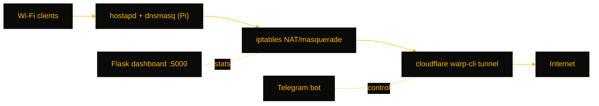

# WarpGate

> Turns a Raspberry Pi into a Wi-Fi access point that routes every client through Cloudflare WARP — with a live Flask dashboard and Telegram control, for homelabbers who want a privacy hotspot with no per-device VPN clients.

[](https://github.com/OneByJorah/WarpGate)
[](https://github.com/OneByJorah/WarpGate)
[](https://github.com/OneByJorah/WarpGate/stargazers)
[](https://github.com/OneByJorah/WarpGate/commits)
[](https://github.com/OneByJorah/WarpGate/actions)

## What This Is

Putting Cloudflare WARP on every device means installing and managing a client everywhere. WarpGate moves the tunnel to the edge: a Raspberry Pi runs `hostapd`, `dnsmasq`, and `iptables` to create a Wi-Fi AP, then masquerades all client traffic through the `warp-cli` tunnel — so anything that joins the network browses through WARP automatically. A Flask + SocketIO dashboard and a Telegram bot expose status and control. It is aimed at homelabbers and travelers who want a "connect and you're through WARP" hotspot.

The full gateway requires Pi hardware; the Docker image runs the dashboard only, serving mock stats as a preview.

## Quick Start

```bash
git clone https://github.com/OneByJorah/WarpGate.git && cd WarpGate
sudo bash 01_install.sh && sudo bash 02_configure.sh
warp-cli registration new && warp-cli connect
```

The dashboard is then live at **http://\<pi-ip\>:5000**. For a dashboard-only preview on any machine: `cp .env.example .env && docker compose up -d`.

## Features

- Creates a hostapd Wi-Fi AP with dnsmasq DHCP/DNS and per-client lease tracking
- Transparent iptables NAT/masquerade from the AP subnet through the WARP interface
- Live dashboard (Flask + SocketIO) with WebSocket-pushed connection stats, traffic, and system health
- Telegram bot to start/stop/reconnect WARP, list leases, and restart services
- Systemd units (`warpgate-dashboard`, `warpgate-bot`) so the stack auto-starts on boot
- Dashboard POST endpoints only accept requests from the AP subnet; Docker mode returns mock stats

## Architecture



## Stack

Python, Flask, Flask-SocketIO, eventlet, Gunicorn, hostapd, dnsmasq, iptables, Cloudflare WARP (`warp-cli`), systemd, Docker.

## Contributing

Contributions are welcome — read [CONTRIBUTING.md](CONTRIBUTING.md), then [open an issue](https://github.com/OneByJorah/WarpGate/issues).

## License

MIT — see LICENSE.
