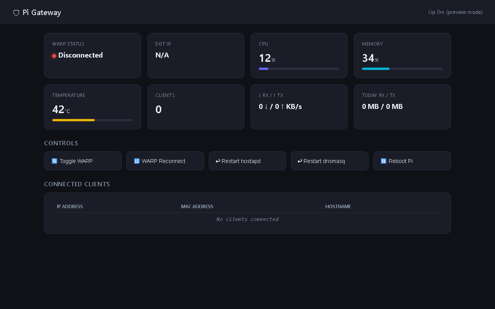

<div align="center">

[](LICENSE)
[](https://www.python.org)
[](https://www.raspberrypi.com)

</div>

<p align="center">
  
</p>

**WarpGate** turns a Raspberry Pi into a Cloudflare WARP gateway with a real-time web dashboard and Telegram bot control. It creates a WARP-tunneled Wi-Fi access point that routes all connected clients through Cloudflare's zero-trust network — no WireGuard clients required.

---

## Features

- **Cloudflare WARP Tunnel** — routes all traffic through Cloudflare's encrypted network via `warp-cli`
- **Wi-Fi Access Point** — creates a captive AP with `hostapd` so any device can connect and browse through WARP
- **Real-time Dashboard** — Flask + SocketIO web UI with live connection stats, dnsmasq lease tracking, and WebSocket push updates
- **Telegram Bot** — manage the gateway remotely: start/stop WARP, view stats, reconnect, and restart services
- **dnsmasq Integration** — built-in DHCP and DNS for the AP subnet with per-client tracking
- **iptables Routing** — transparent NAT/masquerade from the AP subnet through the WARP interface
- **Systemd Services** — auto-starts on boot with dedicated `warpgate-dashboard` and `warpgate-bot` units
- **Docker Dashboard** — run the dashboard in a container for standalone monitoring (full gateway requires RPi hardware)

---

## Architecture

```
┌─────────────────────────────────────────────────────┐
│                   Raspberry Pi                       │
│                                                      │
│  ┌──────────┐   ┌──────────┐   ┌──────────────────┐ │
│  │ hostapd  │   │ dnsmasq  │   │ iptables (NAT)   │ │
│  │  (AP)    │──▶│  (DHCP)  │──▶│  masquerade to   │ │
│  │ wlan1    │   │          │   │  WARP interface  │ │
│  └──────────┘   └──────────┘   └───────┬──────────┘ │
│                                         │             │
│                              ┌──────────▼──────────┐ │
│                              │  Cloudflare WARP    │ │
│                              │  (warp-cli)         │ │
│                              └──────────┬──────────┘ │
│                                         │             │
│  ┌──────────────┐  ┌────────────────────▼──────────┐ │
│  │  Dashboard   │  │      Internet (encrypted)     │ │
│  │  :5000       │  └───────────────────────────────┘ │
│  └──────────────┘                                    │
│  ┌──────────────┐                                    │
│  │ Telegram Bot │                                    │
│  └──────────────┘                                    │
└─────────────────────────────────────────────────────┘
```

---

## Requirements

| Component | Minimum | Recommended |
|-----------|---------|-------------|
| Hardware | Raspberry Pi 3B+ | Raspberry Pi 4/5 (2GB+) |
| OS | Raspberry Pi OS Lite (Bookworm) | 64-bit Lite |
| Wi-Fi Adapter | 1 (built-in) | 2 (built-in + USB for AP) |
| Python | 3.11+ | 3.12 |
| Cloudflare Account | Free WARP plan | Zero Trust (optional) |
| Docker | 20.10+ (dashboard only) | Latest |

**Software packages** (installed automatically by setup scripts):
- `hostapd` — Wi-Fi access point daemon
- `dnsmasq` — DHCP/DNS server
- `iptables` — packet filtering and NAT
- `warp-cli` — Cloudflare WARP client

---

## Quick Start

### Option 1 — Raspberry Pi (Full Gateway)

```bash
# Clone the repository
git clone https://github.com/OneByJorah/WarpGate.git
cd WarpGate

# Step 1: Install system packages (hostapd, dnsmasq, Python deps)
sudo bash 01_install.sh

# Step 2: Configure AP, dashboard, bot, and systemd services
sudo bash 02_configure.sh

# Configure your Cloudflare WARP connection
warp-cli registration new
warp-cli connect

# Access the dashboard
open http://<raspberry-pi-ip>:5000
```

### Option 2 — Docker (Dashboard Only)

```bash
git clone https://github.com/OneByJorah/WarpGate.git
cd WarpGate

# Copy and edit environment config
cp .env.example .env
nano .env

# Start the dashboard
docker compose up -d

# View logs
docker compose logs -f

# Access the dashboard
open http://localhost:5000
```

### Option 3 — Local Python (Development)

```bash
git clone https://github.com/OneByJorah/WarpGate.git
cd WarpGate

python -m venv .venv
source .venv/bin/activate  # Windows: .venv\Scripts\activate
pip install -r requirements.txt

cp .env.example .env
python dashboard.py
```

---

## Configuration

Copy `.env.example` to `.env` and set your values:

| Variable | Description | Default |
|----------|-------------|---------|
| `WAN_IFACE` | WAN network interface | `eth0` |
| `AP_IFACE` | Wi-Fi AP interface | `wlan1` |
| `AP_SSID` | Wi-Fi network name | `WarpGate` |
| `AP_PASS` | Wi-Fi password (8+ chars) | `changeme123` |
| `AP_CHANNEL` | Wi-Fi channel | `6` |
| `AP_COUNTRY` | Country code (e.g. `US`) | `US` |
| `AP_IP` | AP interface IP | `192.168.4.1` |
| `AP_SUBNET` | AP subnet | `192.168.4.0/24` |
| `AP_DHCP_START` | DHCP range start | `192.168.4.10` |
| `AP_DHCP_END` | DHCP range end | `192.168.4.200` |
| `WARP_MTU` | WARP tunnel MTU | `1280` |
| `DASHBOARD_PORT` | Dashboard web port | `5000` |
| `BOT_TOKEN` | Telegram bot token | *(required)* |
| `ADMIN_CHAT_ID` | Telegram admin chat ID | *(required)* |

---

## Telegram Bot

WarpGate includes a Telegram bot for remote management. The bot supports:

- `/status` — view WARP connection state and client count
- `/start` / `/stop` — connect or disconnect the WARP tunnel
- `/reconnect` — restart the WARP tunnel
- `/restart` — restart all gateway services
- `/leases` — list active DHCP clients

### Setup

1. Create a bot via [@BotFather](https://t.me/BotFather) and get the token
2. Get your chat ID by messaging [@userinfobot](https://t.me/userinfobot)
3. Set `BOT_TOKEN` and `ADMIN_CHAT_ID` in your `.env` or during `02_configure.sh`

---

## Project Structure

```
WarpGate/
├── dashboard.py            # Flask + SocketIO web application
├── requirements.txt        # Python dependencies
├── .env.example            # Environment variable template
├── install.sh              # Docker-based installer (bash)
├── install.ps1             # Docker-based installer (PowerShell)
├── 01_install.sh           # RPi system package installation
├── 02_configure.sh         # RPi configuration (AP, bot, systemd)
├── Dockerfile              # Dashboard container build
├── docker-compose.yml      # Docker Compose for dashboard
├── templates/
│   └── dashboard.html      # Web UI template
├── scripts/
│   └── gw-stats.sh         # WARP stats collection script
├── docs/
│   ├── assets/
│   │   └── banner.svg      # Project banner
│   └── screenshots/
│       └── dashboard.png   # Dashboard screenshot
├── LICENSE
├── ROADMAP.md
└── AUDIT_REPORT.md
```

---

## Dashboard

The real-time dashboard displays:

- **WARP connection status** — connected/disconnected with latency
- **Active clients** — count and list of connected devices via dnsmasq leases
- **Traffic stats** — bytes in/out through the WARP tunnel
- **System health** — CPU, memory, and network interface status
- **Subnet controls** — manage DHCP range and AP settings

Updates are pushed live over WebSocket — no page refresh required.

<p align="center">
  
</p>

---

## Development

```bash
# Clone and set up
git clone https://github.com/OneByJorah/WarpGate.git
cd WarpGate
python -m venv .venv
source .venv/bin/activate
pip install -r requirements.txt

# Run in development mode (no auth, mock stats fallback)
python dashboard.py

# The dashboard starts on http://localhost:5000
# In container/dev mode without WARP, mock stats are served automatically
```

---

## Security

- Subnet restriction: dashboard POST endpoints only accept requests from the AP subnet (`192.168.4.0/24`)
- In Docker/dev mode without `warp-cli`, mock stats are returned — no tunnel traffic is exposed
- No sensitive data is logged to stdout

For full security details, see [AUDIT_REPORT.md](AUDIT_REPORT.md).

---

## Roadmap

See [ROADMAP.md](ROADMAP.md) for planned features including multi-SSID support, WireGuard fallback, and parental controls.

---

## Contributing

Contributions welcome. Open an issue or submit a pull request.

1. Fork the repo
2. Create a feature branch (`git checkout -b feature/amazing-feature`)
3. Commit (`git commit -m 'Add amazing feature'`)
4. Push (`git push origin feature/amazing-feature`)
5. Open a Pull Request

---

## License

MIT — see [LICENSE](LICENSE).

---

<p align="center">
  Built for Raspberry Pi · Powered by <a href="https://www.cloudflare.com/1111/">Cloudflare WARP</a>
</p>
